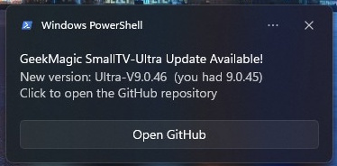

# GeekMagicClock Version Checker

Stay informed when a new **GeekMagic SmallTV-Ultra** firmware release appears on GitHub.

This project is a lightweight Windows-based update watcher built for users who want a simple, reliable way to monitor the `GeekMagicClock/smalltv-ultra` repository without manually checking it every day. The script looks for the newest `Ultra-V*` release folder, compares it with your last known version, and alerts you with a native Windows toast notification when something new shows up.


It can also install itself into **Windows Task Scheduler**, including a hidden launcher so scheduled runs happen quietly in the background without flashing a PowerShell window.

## What it does

- Queries the GitHub repository contents API for available firmware folders
- Detects the latest version by sorting `Ultra-Vx.y.z` directory names
- Saves your local baseline version in `last_known_version.txt`
- Sends a Windows toast notification when a newer release is found
- Writes a simple activity log to `version_check.log`
- Installs itself as a recurring scheduled task with one command
- Runs scheduled checks in the background through a hidden `.vbs` launcher

## Why this script exists

The official firmware repository is easy to miss if you are not checking it regularly. This script automates that process in a clean, low-maintenance way:

- no third-party modules
- no separate installer
- no heavy background app
- just a PowerShell script and an optional scheduled task

## Files in this repository

| File | Purpose |
| --- | --- |
| `Check-GeekMagicVersion.ps1` | Main script that checks GitHub, compares versions, sends notifications, and can install the scheduled task |
| `Run-GeekMagicVersionChecker.vbs` | Hidden launcher used by Task Scheduler so the script runs in the background |
| `last_known_version.txt` | Stores the last version seen by the checker |
| `version_check.log` | Basic log of checks, updates, installs, and errors |

## Requirements

- Windows
- PowerShell 5.1 or PowerShell 7+
- Internet access to GitHub API
- Permission to create a scheduled task if you want automatic checks

## Quick start

Run the checker manually:

```powershell
.\Check-GeekMagicVersion.ps1
```

On the first run, the script saves the current latest version as a baseline.

On later runs:

- if nothing changed, it reports that you are up to date
- if a new version appears, it shows a toast notification and updates the saved version

## Install as a scheduled background task

Create a scheduled task with the default settings:

```powershell
.\Check-GeekMagicVersion.ps1 -InstallScheduledTask
```

This creates a task named:

```text
GeekMagicClock Version Checker
```

Default behavior:

- starts at `09:00`
- repeats every `60` minutes
- runs hidden in the background

### Custom schedule examples

Run every 30 minutes starting at 08:00:

```powershell
.\Check-GeekMagicVersion.ps1 -InstallScheduledTask -CheckIntervalMinutes 30 -StartTime 08:00
```

Replace an existing task:

```powershell
.\Check-GeekMagicVersion.ps1 -InstallScheduledTask -Force
```

Use a custom task name:

```powershell
.\Check-GeekMagicVersion.ps1 -InstallScheduledTask -TaskName "GeekMagicClock Firmware Watcher"
```

## How notifications work

The script uses native Windows toast notifications.

When launched from **Windows PowerShell 5.1**, the toast is created directly.

When launched from **PowerShell 7+ (`pwsh`)**, the script delegates the toast creation step to Windows PowerShell 5.1 because the required WinRT notification types are not directly available in `pwsh`.

That means you can run the checker from modern PowerShell while still getting native Windows notifications.

## How background scheduling works

Task Scheduler starts:

```text
wscript.exe
```

That launcher then runs:

```text
Run-GeekMagicVersionChecker.vbs
```

The `.vbs` file starts PowerShell in hidden mode so scheduled checks do not flash an empty console window.

## Viewing the scheduled task

You can find the task in Windows:

1. Open **Task Scheduler**
2. Select **Task Scheduler Library**
3. Look for `GeekMagicClock Version Checker` or your custom task name

You can also check it from PowerShell:

```powershell
Get-ScheduledTask -TaskName "GeekMagicClock Version Checker"
Get-ScheduledTaskInfo -TaskName "GeekMagicClock Version Checker"
```

## Logging and state

The script keeps its state in simple local files:

- `last_known_version.txt` keeps the saved version
- `version_check.log` stores basic history and errors

If you want to reset the baseline, you can edit or remove `last_known_version.txt` and run the script again.

## Typical workflow

1. Run the script once manually to confirm it works on your machine
2. Install it into Task Scheduler
3. Let it run quietly in the background
4. Receive a Windows notification when a new firmware version appears

## Notes

- The script currently watches the GitHub repository root for folders matching `Ultra-Vx.y.z`
- The scheduled task installer creates the hidden launcher automatically
- The project is intentionally small and easy to audit

## License

Use, modify, and publish as needed for your own GeekMagic workflow.
